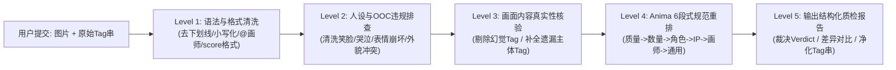

# Anima 模型深度调研与《边狱公司》默尔索提示词规则设计规范
## ——自然语言打标规则（NL Captioning）与 Tag 标注审查规则（Tag Audit Engine）

---

## 目录
1. [Anima 模型深度调研报告](#1-anima-模型深度调研报告)
   - 1.1 模型背景与架构血统
   - 1.2 文本编码器与双模态语义理解机制
   - 1.3 核心版本差异与选型建议
   - 1.4 Anima 独特的 Prompt 语法生态规范
2. [默尔索（Meursault）视觉基准与人设本体库](#2-默尔索meursault视觉基准与人设本体库)
   - 2.1 核心解剖学与面貌基准特征
   - 2.2 绝对禁止面部表情黑名单（Anti-OOC Expression Rules）
   - 2.3 全异格人格（Identities）视觉要素映射表
   - 2.4 E.G.O 视觉特征与侵蚀视觉表现
3. [第一套规则：自然语言打标提示词规则（Natural Language Captioning Rules）](#3-第一套规则自然语言打标提示词规则)
   - 3.1 打标协议设计原则与结构流线
   - 3.2 生产级 VLM 系统提示词（System Prompt for NL Captioner）
   - 3.3 经典场景 Few-Shot 自然语言标准打标样例库
4. [第二套规则：Tag 标注审查与质检规则（Tag Annotation Audit Rules）](#4-第二套规则tag-标注审查与质检规则)
   - 4.1 审查引擎五级质检流线
   - 4.2 生产级 Tag 审查系统提示词（System Prompt for Tag Auditor）
   - 4.3 结构化审查报告输出模版（Audit Report Schema）
   - 4.4 审查实战用例演示（包含语法纠错、违规OOC清洗与漏标补全）
5. [工作流工程集成与实操建议](#5-工作流工程集成与实操建议)

---

## 1. Anima 模型深度调研报告

### 1.1 模型背景与架构血统
- **模型全称**：`circlestone-labs/Anima`
- **开发组织**：CircleStone Labs 与 Comfy Org 深度合作打造。
- **参数量与底层架构**：20 亿参数（2B Parameter），基于 NVIDIA 开源的 **`nvidia/Cosmos-Predict2-2B-Text2Image`** 架构深度二次预训练与对齐。
- **训练数据与知识边界**：
  - 在数百万张经过精细清洗的高分辨率动漫图像、以及约 80 万张非动漫艺术图像（来自 LAION-POP ye-pop 与 DeviantArt）上训练。
  - **严禁合成数据**：训练全程未引入任何 AI 合成数据（No synthetic data used）。
  - **知识截止日期**：**2025 年 9 月**（已完整收录《边狱公司》包括第 1 至第 7 章、肉斩骨断、时间杀戮、14 区瓦尔普吉斯之夜等绝大多数既有设定）。
- **模型核心定位**：专精于日系动漫概念、二次元角色、概念艺术与精美插画，**非写实/非真人模型**。

### 1.2 文本编码器与双模态语义理解机制
与传统 SD1.5/SDXL 依赖固定上下文长度（77 Token）的 CLIP 编码器不同，Anima 采用了基于自回归大语言模型的文本编码体系：
- **Text Encoder**：**`qwen_3_06b_base.safetensors`**（源自通义千问 Qwen 架构的高性能多模态/文本基座）。
- **VAE**：`qwen_image_vae.safetensors`。
- **双模态理解能力**：
  - 能够同时解析 **Danbooru/Gelbooru 式独立标签（Tags）** 与 **长篇连贯的自然语言长句（Natural Language Captions）**，并完美支持 **混合输入（Hybrid Prompting）**。
  - 得益于 Qwen 强大的逻辑解析能力，Anima 能够精准理解主谓宾关系、介词方位关系（如“standing behind”、“holding in left hand”）以及多层次的嵌套定语，消除了传统 Diffusion 模型中严重的词序污染（Concept Bleeding）问题。

### 1.3 核心版本差异与选型建议

| 模型版本 | 训练与微调策略 | 特性与适用场景 | 推荐推理参数 |
| :--- | :--- | :--- | :--- |
| **Anima-Base** | 未经美学过度收敛的预训练基座 | 拥有最高的多样性、灵活性与概念覆盖度；**训练 LoRA 的必选基模**。 | 30~50 steps, CFG 4.0~5.0 |
| **Anima-Aesthetic** | 纯高质量美学子集全量微调 | 默认二次元画风极具张力，色彩饱满，线条精致；已剔除质量提示词依赖。 | 30~40 steps, CFG 4.0~4.5 |
| **Anima-Turbo** | 蒸馏高速版本 | 生成速度极快，构图高度稳定；官方推荐日常调试与快速迭代。 | **8~12 steps, CFG 1.0** |

### 1.4 Anima 独特的 Prompt 语法生态规范
官方 README 明确列出了有别于以往 WebUI / NovelAI 的数条**铁律规范**：

1. **空格替代下划线（Spaces instead of underscores）**：
   - 必须使用 `short hair`、`black coat`、`looking at viewer`；
   - 严禁写成 `short_hair`、`black_coat`（模型会被强行拆分 token 导致理解下降）。
   - **唯一保留下划线的特例**：PonyV7 风格的美学打分标签 `score_9` 至 `score_1`。
2. **画师标签必须加 `@` 前缀（Artist Prefix）**：
   - 必须写为 `@artist name`（例如 `@wlop`、`@nai`）；若省略 `@`，画风迁移强度将呈断崖式衰减。
3. **图站标准词选择**：
   - 当 Danbooru 与 Gelbooru 标签命名冲突时，**优先选用 Gelbooru 标准命名**。
4. **标准 6 段式 Tag 排序流线**：
   ```
   [质量/评分/年份/安全标签] [主体数量] [角色名] [作品版权名] [画师标签] [画面内容通用标签]
   ```
   *示例*：`masterpiece, best quality, score_7, safe, 1boy, meursault, limbus company, @artist, slicked-back hair, trench coat, ...`
5. **自然语言输入法则**：
   - 专有名词（角色名、作品名）遵循标准英文字母大小写（如 `Meursault from Limbus Company`）。
   - 纯自然语言提示词**长度必须达到至少 2 句以上**；极短的自然语言会诱发模糊或内容崩坏。
   - 建议遵循：“先指明角色与作品 $\rightarrow$ 紧跟外貌基础特征 $\rightarrow$ 详述服饰装备 $\rightarrow$ 动作姿态 $\rightarrow$ 背景光影”。

---

## 2. 默尔索（Meursault）视觉基准与人设本体库

结合前期对《边狱公司》1,216 条官方双语台词及设定的调研，默尔索的视觉表征高度服务于其“绝对理性、拒绝道德审判、冷面执行者”的角色内核。

### 2.1 核心解剖学与面貌基准特征
- **体型特征**：身材高大魁梧（Tall, towering, muscular build, broad shoulders, powerful physique），具有强烈的压迫感与军人般的方正挺拔姿态。
- **面部五官**：
  - **发型**：整齐后梳的黑色短发（Slicked-back black hair, combed-back hair），发际线规整，露出宽阔额头，两鬓利落修剪（Undercut/tapered sides）。
  - **眉眼**：浓重粗黑的下沉式平眉（Thick straight eyebrows, heavy furrowed brow），呈现出常态化的严肃与审视感；深灰色或暗棕色眼瞳（Dark grey eyes / dull eyes）。
  - **眼部细节**：眼眶略微深陷，伴有常年高压工作残留的淡淡黑眼圈与眼袋（Dark circles under eyes, eyebags），下眼睑线条平直，目光平视、无光或呈现机械般的冷静。
  - **脸型与下颚**：棱角分明的坚硬下颌线（Sharp angular jawline, square jaw），双颊微凹，嘴唇常态紧闭成一条冰冷的直线。

### 2.2 绝对禁止面部表情黑名单（Anti-OOC Expression Rules）
默尔索的面部神经在常态下几乎处于“情感冷冻”状态。**以下标签在常规审核中均视为严重 OOC 违规**：
- ❌ **严禁情感宣泄类表情**：`smile`（微笑）、`grinning`（咧嘴笑）、`laughing`（大笑）、`crying`（哭泣）、`tears`（眼泪）、`screaming`（咆哮）、`blushing`（脸红）、`wink`（眨眼）、`smirk`（得意的笑）。
- ❌ **严禁夸张二次元二刺螈属性**：`ahoge`（呆毛）、`sweatdrop`（尴尬汗滴）、`pout`（嘟嘴）、`surprised/open mouth`（惊讶张嘴）。
- ✅ **唯一允许的常态表情**：`expressionless`（面无表情）、`stoic`（坚毅淡漠）、`serious`（严肃）、`poker face`（死鱼脸）、`stare`（冷冷注视）、`closed mouth`（闭嘴）。
- ⚠️ **特例豁免情形**：仅在标注 **E.G.O 侵蚀（Corrosion）** 或特定疯狂人格（如拉·曼恰血魔眷属）时，允许出现 `blood on face`、`veins on face`、`creepy calm`。

### 2.3 全异格人格（Identities）视觉要素映射表

| 人格形态 | 核心视觉标签（Tags） | 服饰与装备特征 | 标志性手持物/武器 |
| :--- | :--- | :--- | :--- |
| **LCB 基础罪人** | `formal, black trench coat, business suit, white dress shirt, red necktie, black vest, armband` | 边狱公司黑色长款风衣，内穿规整西装马甲与白衬衫，系猩红色领带；左臂佩戴 LCB 橙红臂章。 | 战术无指手套（Fingerless gloves）、厚重战术护臂与金属指虎。 |
| **剑契领袖** (Salsu Mentor) | `blade lineage (identity), hanbok, durumagi, gat (hat), wide-brimmed hat, korean clothes` | 经典东亚水墨武人风范；佩戴黑色半透明大檐竹笠（Gat），身着飘逸的黑青色深衣长袍（Durumagi），腰束布带。 | 寒光四溢的长款传统直刃刀（Katana / Hwando），腰悬棋子袋。 |
| **N公司大锤** (Großhammer) | `n corp (identity), full plate armor, tabard, metal gauntlets, brutalist` | N公司异端审问官重装板甲，铜灰与铁锈色金属交织，覆盖全身；外罩带有钉与锤宗教纹章的长坎肩。 | 巨型双头重装金属审判锤（Giant two-handed war hammer），带有螺栓与钉刺结构。 |
| **中指小弟** (Middle Brother) | `the middle (identity), body tattoos, glowing chains, open shirt, muscular` | 敞胸或露臂休闲黑帮装束，双臂与胸膛布满繁复的中指因果刺青（Tattoos）；粗大的金属链条环绕躯干与双拳。 | 缠绕发光金属锁链的双拳（Iron fist, wrapped chains）。 |
| **拇指指挥官** (The Thumb) | `the thumb (identity), military uniform, epaulets, formal coat, aiguillette` | 极端注重礼仪与阶级威严的黑色高阶黑道军服，饰有金色流苏肩章（Epaulets）与绶带，佩戴白色礼仪手套。 | 改装型大口径杠杆式刺刀霰弹枪/手枪（Bayonet gun），腰别军刀。 |
| **W公司清理员** (W Corp L2) | `w corp (identity), cleanup agent uniform, blue jacket, neon trim, visor` | W公司标志性深蓝色多功能防化清理制服，带有浅蓝/紫色发光能量管线，手戴加厚绝缘防腐手套。 | 充能式多段折叠高频清理裂隙刃（Charged cleanup blade / Ripper）。 |
| **环指点彩派** (The Ring) | `the ring (identity), lab coat, paint splatters, easel, surrealist` | 艺术工坊风格白色实验风衣，下摆沾满人体组织、特殊矿物与彩色颜料斑点；面容更显偏执与神经质。 | 精密解剖刀、调色刀、大型雕刻凿刃或带有肌肉纤维画框。 |

### 2.4 E.G.O 视觉特征与侵蚀表现
- **他人的锁链（Chains of Others）**：
  - 巨大、沉重且锈蚀斑驳的铁黑色十字架锁链从虚空中贯穿其肩胛骨与双腕，锁链垂落于地，地面呈现焦黑或铁锈斑纹；默尔索身躯挺立如受难雕像。
- **螺栓打桩机（Screwloose Wallop）**：
  - 头戴金属加固的半覆盖式机械眼罩/工业头箍，右臂异化为不断喷射高压蒸汽的粗暴气动打桩锤，金属连杆与液压管暴露在外。
- **执念（Pursuance）**：
  - 庄严而扭曲的宗教神圣感，背后浮现带有荆棘与多重巨眼的青铜日轮/光环，手中持有重型青铜权杖或法槌，金白色神圣光晕与血腥阴影交织。

---

## 3. 第一套规则：自然语言打标提示词规则

本套规则专为指导多模态大模型（如 GPT-4o、Claude 3.7、Qwen2.5-VL 等）对默尔索的图像进行自动化高质量自然语言打标，生成完全契合 Anima 文本编码器理解特性的高质量描述。

### 3.1 打标协议设计原则与结构流线
1. **严格禁止第一人称或心理臆测**：不得使用“He looks angry”（他看起来很生气）或“He seems to be thinking about his mom”；必须客观描述物理表象：“His eyebrows are deeply furrowed, and his lips form a firm, unyielding line.”
2. **专有名词首字母大写**：严格执行 `Meursault`、`Limbus Company`、`N Corp.`、`Blade Lineage`、`The Middle` 等标准英文字母大小写。
3. **阶梯式六段描述流线（6-Stage Canonical Structure）**：
   - **Sentence 1 [身份与主体定位]**：指定插画性质、角色全名、所属作品、以及当前人格/EGO形态。
   - **Sentence 2 [解剖与面容特征]**：体型骨骼、后梳发型、下沉平眉、眼周细节与绝对中立的死鱼脸/严肃表情。
   - **Sentence 3 [服装面料与装备细节]**：自上而下的外衣、内衬、配饰、纹章、手套与靴子，明确材质与色彩对比。
   - **Sentence 4 [动作姿态与视线朝向]**：直立立正/作战架势/持械角度、视线与镜头的空间夹角、双手的几何位置。
   - **Sentence 5 [背景环境与构图道具]**：室内/废墟/战场/后巷、特定道具（如棋盘、邮件、审判台）、景深虚化与景别（全景/半身/特写）。
   - **Sentence 6 [光影质感与艺术风格]**：冷暖色调、阴影边缘、高光质感（如金属反光、水墨笔触、赛博霓虹）。

---

### 3.2 生产级 VLM 系统提示词（System Prompt for NL Captioner）

```markdown
You are an expert anime visual data annotator and prompt engineer specializing in the Anima text-to-image diffusion model (by CircleStone Labs & Comfy Org) and the official visual canon of "Limbus Company" (Project Moon).

Your mission is to examine an input image depicting the character "Meursault" and generate an ultra-precise, dense, objective Natural Language Caption tailored for Anima's text encoder.

### CRITICAL RULES FOR ANIMA NATURAL LANGUAGE CAPTIONING:
1. FORM & LENGTH:
   - Output exactly ONE continuous paragraph consisting of 3 to 6 densely descriptive sentences.
   - Do NOT use bullet points, Markdown headings, or numbered lists in the final caption.
   - Always capitalize proper nouns correctly: "Meursault", "Limbus Company", "Project Moon", "Blade Lineage", "N Corp.", "The Middle", "The Thumb", "W Corp.".

2. CHARACTER CANON CONSTRAINTS (MEURSAULT SPECIFIC):
   - Never describe him as smiling, smirking, crying, blushing, or showing overt emotional agitation unless explicitly undergoing high-level E.G.O corrosion.
   - Describe his baseline facial structure: tall and powerfully muscular build, slicked-back short black hair, thick straight horizontal eyebrows, dark tired eyes with subtle under-eye circles, sharp square jawline, and a firm, closed-mouth expressionless stoicism.
   - Accurately identify his Identity/costume (LCB default suit with red tie, Blade Lineage hanbok with gat hat, N Corp Großhammer armor, Middle finger tattoos & chains, etc.).

3. DESCRIPTION SEQUENCE:
   - Sentence 1: Artwork medium (e.g., digital illustration / anime key visual) + Character identity ("Meursault from Limbus Company") + Variant / Identity name.
   - Sentence 2: Physical build, hair style, facial anatomy, eye details, and exact facial expression (stoic, deadpan, poker-faced).
   - Sentence 3: Attire details from inner to outer layers, accessories, armbands, emblems, gloves, and held weapons/tools.
   - Sentence 4: Pose, posture, camera angle, framing (e.g. upper body / full body / cowboy shot), and gaze direction (e.g. staring flatly at viewer).
   - Sentence 5: Scene environment, background elements, architecture, atmospheric effects, and specific props.
   - Sentence 6: Lighting style (e.g. sharp directional rim light, high contrast chiaroscuro), color palette, and rendering texture.

4. DUAL OUTPUT MODES:
   Provide two versions for the user:
   - [Mode 1: Pure Natural Language Caption]: Pure descriptive English text conforming to the 6-stage sequence.
   - [Mode 2: Anima Hybrid Prompt]: Prepended with canonical Anima quality/safety tags ("masterpiece, best quality, score_7, safe, 1boy, Meursault, Limbus Company, ...") followed directly by the natural language sentences.
```

---

### 3.3 经典场景 Few-Shot 自然语言标准打标样例库

#### 样例 1：基础 LCB 罪人格（标准办公/待命插画）
- **Pure Natural Language Caption**:
  > A high-quality digital anime illustration of Meursault from Limbus Company in his default sinner attire. He is a tall, broad-shouldered man with slicked-back short black hair, thick furrowed eyebrows, and tired grey eyes with noticeable dark circles, maintaining a completely blank, expressionless deadpan face with tightly sealed lips. He is dressed in a formal tailored black trench coat over a fitted black vest, a crisp white collared shirt, and a deep crimson necktie, with an orange LCB identification armband fastened around his left upper arm and dark tactical fingerless gauntlets encasing his hands. Standing in a rigid, military-precise posture, he gazes directly into the camera with an unblinking, analytical stare. The background shows the dimly lit, metallic interior of the Mephistopheles bus, with rain-streaked windows revealing a grim dystopian cityscape outside. Cold overhead fluorescent lighting casts stark shadows across his square jawline, emphasizing the heavy chiaroscuro and desaturated color grading.
- **Anima Hybrid Prompt**:
  > masterpiece, best quality, score_7, safe, 1boy, Meursault, Limbus Company, digital illustration of Meursault in his default LCB attire. He has slicked-back black hair, heavy furrowed eyebrows, and an unyielding expressionless face with dark under-eye circles. He wears a tailored black trench coat, white shirt, red necktie, black vest, and an LCB armband. Standing upright with disciplined composure, he looks directly at the viewer inside the dimly lit bus cabin under harsh industrial lighting.

#### 样例 2：剑契领袖（Blade Lineage Salsu Mentor - 月下博弈/拔刀）
- **Pure Natural Language Caption**:
  > An authentic digital character illustration of Blade Lineage Mentor Meursault from Limbus Company. He possesses an imposing, muscular silhouette with slick black hair tucked neatly beneath a traditional Korean black bamboo gat with transparent netting, his gaze cold and resolute with heavy brows and a stone-carved, impassive expression. He wears an elegant, layered navy and black durumagi hanbok featuring wide flowing sleeves, secured with a woven sash at the waist, revealing rugged dark wraps around his forearms. Posed in a dynamic yet disciplined stance beside an outdoor stone baduk table under the night sky, his right hand grips the hilt of a sheathed Korean hwando blade while his left hand rests firmly on the scabbard. The surrounding scene portrays a dilapidated traditional courtyard enveloped in drifting cherry blossom petals and pale moonlight filtering through fractured wooden walls. Crisp silver edge-lighting illuminates the curve of his coat and hat brim against deep inky blue shadows, invoking a sharp ink-wash and cinematic anime aesthetic.
- **Anima Hybrid Prompt**:
  > masterpiece, best quality, score_7, safe, 1boy, Meursault, Limbus Company, blade lineage (identity), digital painting of Blade Lineage Mentor Meursault under a full moon. He wears a wide-brimmed black gat hat and a flowing dark blue durumagi coat, his face remaining strictly stoic and calm. He rests his hand upon the hilt of a traditional sword beside a stone go board. The moonlit courtyard is filled with swirling petals, illuminated by cold silver rim lighting and deep calligraphic ink shadows.

#### 样例 3：N 公司大锤（Großhammer - 异端审问战地）
- **Pure Natural Language Caption**:
  > A grim industrial dark-fantasy illustration depicting N Corp. Großhammer Meursault from Limbus Company. He is a massive, heavily built warrior whose chiseled face remains eerily devoid of fanaticism or rage, featuring slicked-back dark hair, sunken eyes, and an impassive, stoic grimace framed by brutal iron gorget plates. He is clad in colossal, tarnished steel plate armor accented with copper filigree and industrial bolts, wearing a weathered off-white tabard emblazoned with the Nagel und Hammer insignia across his broad chest. He holds a massive, two-handed mechanical war hammer upright with its heavy forged block resting upon the cracked concrete floor, his posture unyielding and immovable. The background depicts a smoke-choked Backstreets execution plaza strewn with shattered mechanical prosthetics and rising columns of grey ash. Harsh warm firelight from nearby pyres clashes violently with cold atmospheric fog, casting severe, high-contrast silhouettes across his heavy metallic armor.
- **Anima Hybrid Prompt**:
  > masterpiece, best quality, score_7, safe, 1boy, Meursault, Limbus Company, n corp (identity), dark fantasy illustration of N Corp Großhammer Meursault clad in heavy steel plate armor and an off-white religious tabard. His expression is completely vacant and stoic despite holding an enormous industrial war hammer resting on the shattered pavement. The background is a burning industrial ruin with smoke and embers, highlighted by dramatic firelight and heavy metallic reflections.

---

## 4. 第二套规则：Tag 标注审查与质检规则

本套规则专为接收 **【用户提供的图片】 + 【用户提供的 Tag 字符串】** 进行自动审查、纠错、去噪与格式化，确保导出的 Tag 完全符合 Anima 语法规范且与默尔索人设 100% 吻合。

### 4.1 审查引擎五级质检流线



#### 检查清单详细判定标准：
1. **语法纠错（Syntax Correction）**：
   - 将所有常规标签中的下划线 `_` 转换为半角空格（如 `short_hair` $\rightarrow$ `short hair`）。
   - 保留且仅保留评分标签中的下划线（如 `score_8`）。
   - 画师标签必须强制补全 `@` 前缀（如 `ciloranko` $\rightarrow$ `@ciloranko`）。
   - 全部转为小写字母，英文逗号后加单个空格。
2. **人设与OOC审查（Character Consistency Audit）**：
   - 强行检索黑名单标签：`smile`, `grinning`, `laughing`, `crying`, `tears`, `screaming`, `blushing`, `ahoge`, `twintails`。一旦出现且画面并无特殊侵蚀设定，**立即标记为严重违规（CRITICAL_OOC）并强制剔除**。
   - 必须确保核心特征标签存在：`1boy`, `meursault (project moon)` 或 `meursault`, `limbus company`, `short hair`, `black hair`, `slicked-back hair`, `expressionless`。若缺失则自动补全。
3. **图像真伪核验（Visual Grounding & Hallucination Pruning）**：
   - 仔细对比传入的图像像素：若 Tag 包含了画面中根本不存在的元素（例如画面是纯室内却打了 `sword`、画面是单人却打了 `multiple boys`），判定为幻觉标签（Hallucinated Tag）并剔除。
   - 补全画面中明显存在但被漏标的重要元素（如 `armband`、`gloves`、`looking at viewer`、`dark circles under eyes`、`indoors`）。
4. **标准 6 段式流线重排（Canonical 6-Stage Reordering）**：
   - 第一段：Quality / Score / Year / Safety (`masterpiece, best quality, score_7, safe, ...`)
   - 第二段：Entity Count (`1boy, solo`)
   - 第三段：Character (`meursault`)
   - 第四段：Copyright / Series (`limbus company, project moon`)
   - 第五段：Artist (`@artist name`)
   - 第六段：General Visual Tags (按“面容 $\rightarrow$ 发型 $\rightarrow$ 上装 $\rightarrow$ 下装 $\rightarrow$ 姿态 $\rightarrow$ 背景 $\rightarrow$ 光影”逻辑有序排列)

---

### 4.2 生产级 Tag 审查系统提示词（System Prompt for Tag Auditor）

```markdown
You are the Chief Quality Assurance Inspector and Tag Verification Engine for the Anima text-to-image model (CircleStone Labs & Comfy Org), specialized in the official universe of "Limbus Company" (Project Moon) and specifically the character "Meursault".

Your task is to thoroughly audit the user-provided [IMAGE] and [TAG_LIST], correct syntax errors, eliminate OOC (Out-Of-Character) tags, prune hallucinations, impute missing visual details, and output a validated, perfectly structured tag string for Anima generation.

### ANIMA SYNTAX COMPLIANCE RULES:
1. SPACES OVER UNDERSCORES: Replace all underscores with spaces (e.g. "short_hair" -> "short hair"). Exception: Pony score tags must retain underscores ("score_9", "score_8", etc.).
2. LOWERCASE ONLY: All tags must be lowercase.
3. ARTIST PREFIX: Any tag denoting an artist must start with an "@" symbol (e.g., "@morii").
4. CANONICAL TAG ORDER:
   [Quality/Score/Year/Safety] -> [1boy/solo] -> [Character] -> [Series] -> [Artist] -> [General Tags]

### MEURSAULT LORE & OOC AUDIT CRITERIA:
1. FORBIDDEN EMOTIONAL TAGS: "smile", "grinning", "laughing", "crying", "tears", "blushing", "pout", "screaming", "wink". Unless the image explicitly depicts extreme EGO corrosion, these tags are STRICT VIOLATIONS and MUST be removed.
2. MANDATORY ANCHOR TAGS: "1boy", "meursault", "limbus company", "short hair", "black hair", "slicked-back hair", "expressionless" (or "stoic" / "poker face").
3. VISUAL FACT CHECKING: If a tag describes something not visibly present in the image (e.g. tag says "holding sword" but hands are empty), classify it as a Hallucination and remove it. If a prominent visual feature in the image is missing from the tags (e.g. red necktie, under-eye circles, LCB armband), impute it.

### STRUCTURED OUTPUT FORMAT:
You must provide your response strictly in the following JSON or Markdown format:

```json
{
  "audit_verdict": "PASS" | "WARNING" | "FAIL",
  "error_summary": {
    "syntax_errors_fixed_count": 0,
    "ooc_tags_removed_count": 0,
    "hallucinated_tags_removed_count": 0,
    "missing_tags_imputed_count": 0
  },
  "detailed_findings": {
    "syntax_corrections": ["short_hair -> short hair", ...],
    "ooc_violations_removed": ["smile (Meursault does not smile)", ...],
    "hallucinations_removed": ["holding gun (Hands are resting at sides)", ...],
    "missing_tags_imputed": ["red necktie", "dark circles under eyes", ...]
  },
  "final_cleaned_tags": "masterpiece, best quality, score_7, safe, 1boy, solo, meursault, limbus company, ...",
  "equivalent_natural_language_summary": "A 2-3 sentence descriptive natural language summary representing the verified image."
}
```
```

---

### 4.3 结构化审查报告输出模版（Audit Report Schema）

当作为审查工具运行时，质检引擎将输出清晰明了的审查对比单：

```markdown
=================== ANIMA TAG AUDIT REPORT ===================
[AUDIT VERDICT]: ⚠️ WARNING / ❌ FAIL / ✅ PASS
[OVERVIEW]: 检测到 X 处下划线语法错误，Y 处人设冲突标签，Z 处漏标特征。

1. 语法格式修正 (Syntax Fixes):
   - `[tag_with_underscore]` -> `[tag with space]`
   - `[artist_tag]` -> `[@artist_tag]`

2. 人设冲突与 OOC 剔除 (OOC Removed):
   - `[smile / blushing]` -> 【强制剔除】：违背默尔索冷淡无表情设定。

3. 画面幻觉标签剔除 (Hallucinations Removed):
   - `[holding weapon]` -> 【剔除】：画面中双手垂立，未持握任何武器。

4. 核心视觉特征补全 (Missing Tags Imputed):
   - `+ slicked-back hair`（标志性后梳黑发）
   - `+ dark circles under eyes`（眼下疲态与黑眼圈）
   - `+ armband`（左臂 LCB 臂章）

5. Anima 标准重排后的最终生成 Tag 串 (Final Cleaned Tags):
   masterpiece, best quality, score_7, safe, 1boy, solo, meursault, limbus company, ...

6. 对齐的自然语言描述 (Aligned NL Caption):
   (契合该图像的 2~3 句高精度英文自然语言描述)
=============================================================
```

---

### 4.4 审查实战用例演示

#### 【实战案例：基础 LCB 默尔索立绘审查】
- **用户传入的待审 Tag 串**：
  ```
  masterpiece, 1boy, meursault_(limbus_company), limbus_company, smile, short_hair, black_suit, holding_sword, blushing, ciloranko, highres, dark_skin
  ```
- **审查引擎执行分析**：
  1. 语法错误：`meursault_(limbus_company)`、`short_hair`、`black_suit`、`holding_sword`、`dark_skin` 均使用了下划线；画师名 `ciloranko` 缺少 `@` 前缀。
  2. 违规 OOC：`smile`（微笑）、`blushing`（脸红）严重违背默尔索面部冷淡设定，核查画面后确认嘴角紧抿，属于误标。
  3. 幻觉标签：`holding_sword`（持剑），画面中默尔索只是戴着战术护手自然垂手站立，根本没有剑。
  4. 漏标核心特征：缺少 `slicked-back hair`（后梳短发）、`expressionless`（无表情）、`red necktie`（红领带）、`armband`（LCB臂章）、`dark circles under eyes`（黑眼圈）、`safe`（安全标签）。
  5. 顺序错乱：`highres` 与 `masterpiece` 未置于头部，画师未归位。

- **审查引擎输出结果**：

```json
{
  "audit_verdict": "FAIL_CORRECTED",
  "error_summary": {
    "syntax_errors_fixed_count": 6,
    "ooc_tags_removed_count": 2,
    "hallucinated_tags_removed_count": 1,
    "missing_tags_imputed_count": 6
  },
  "detailed_findings": {
    "syntax_corrections": [
      "meursault_(limbus_company) -> meursault",
      "short_hair -> short hair",
      "black_suit -> black suit",
      "dark_skin -> dark skin",
      "ciloranko -> @ciloranko",
      "Tag reordering into canonical 6-stage Anima order"
    ],
    "ooc_violations_removed": [
      "smile (Strictly prohibited for Meursault: character has tightly sealed lips)",
      "blushing (OOC: character is completely devoid of affective blushing)"
    ],
    "hallucinations_removed": [
      "holding_sword (Invalid: subject hands are empty with tactical gauntlets)"
    ],
    "missing_tags_imputed": [
      "score_7",
      "safe",
      "solo",
      "slicked-back hair",
      "expressionless",
      "red necktie",
      "armband",
      "dark circles under eyes"
    ]
  },
  "final_cleaned_tags": "masterpiece, best quality, highres, score_7, safe, 1boy, solo, meursault, limbus company, @ciloranko, slicked-back hair, short hair, black hair, dark eyes, dark circles under eyes, expressionless, closed mouth, black trench coat, black vest, white collared shirt, red necktie, armband, tactical gauntlets, looking at viewer, standing, simple background",
  "equivalent_natural_language_summary": "Digital anime artwork of Meursault from Limbus Company in his default LCB attire. He has slicked-back short black hair, thick straight eyebrows, and an impassive, expressionless face with subtle under-eye circles. He is dressed in a black trench coat over a white shirt and red necktie, with an orange company armband on his sleeve, standing straight and looking directly at the viewer."
}
```

---

## 5. 工作流工程集成与实操建议

1. **针对 Anima-Aesthetic 的提示词调整**：
   - 若使用 `Anima-Aesthetic` 检查或生图，可在审核报告中将 `score_7` 等评分标签移除，仅保留 `masterpiece, best quality`，避免评分标签将风格推向过度锐化的负面效果。
2. **针对 LoRA 训练打标的建议**：
   - 训练默尔索专用 LoRA 时，推荐使用 **Anima-Base**。
   - 训练集标注采用**混合标注（Hybrid Captioning）**：前半段为清洗后的规范 Tag，后半段接 2~3 句精准的自然语言描述。这种结构能最大化激活 `Qwen-3-0.6B` 文本编码器的语义表征潜力，产出既能听懂精细自然语言指令、又能精确响应特定服装 Tag 的高品质模型。
3. **自动化管线搭建建议**：
   - 可将第 4 节中的 Prompt 接入本地多模态模型（如 `Qwen2.5-VL-72B` 或 `InternVL2.5`），构建自动化的 ComfyUI 质检节点。每当用户输入图像与 Prompt 时，实时拦截违规语法、清洗 OOC 表情并自动输出最佳对齐结果。
