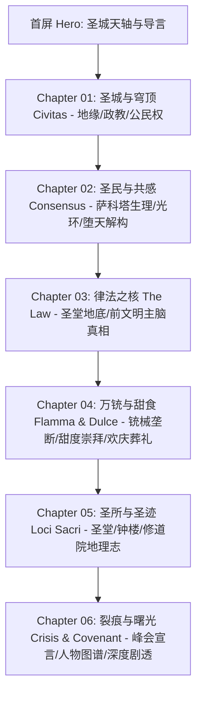

# 《明日方舟》拉特兰世界观调研与《众生行记》风格转译设计规范

> 文档性质：工作区本地设计研究与技术规格底稿（待审批前置产物）  
> 保存路径：`docs/laterano-research-and-design-specs.md`  
> 参考技能规范：`design-hypergryph-aesthetic` (全局技能)  

---

## 目录
1. [拉特兰世界观资料全量梳理与可信度核验](#1-拉特兰世界观资料全量梳理与可信度核验)
2. [《众生行记》视觉签名三态对比与转译推导](#2-众生行记视觉签名三态对比与转译推导)
3. [社区学术参照的图层归位与边界界定](#3-社区学术参照的图层归位与边界界定)
4. [网页整体架构与全景阅读路径规划](#4-网页整体架构与全景阅读路径规划)
5. [视觉与交互设计系统（字体/色彩/材质/动效/响应式）](#5-视觉与交互设计系统字体色彩材质动效响应式)
6. [素材清单、缺口分析与技术实现边界](#6-素材清单缺口分析与技术实现边界)

---

## 1. 拉特兰世界观资料全量梳理与可信度核验

### 1.1 地缘、政治架构与社会制度
- **地缘环境**：位于泰拉大陆中西部，周边与维多利亚（Victoria）、叙拉古（Siracusa）、雷姆必拓（Rim Billiton）以及伊比利亚（Iberia）接壤。主体为多座移动地块构建的神权城邦联合体，首都为拉特兰城（*Civitatis Lateranense*）。
- **政体与教廷（Lateran Church）**：
  - **国家元首**：拉特兰教皇（Pope of Laterano）。现任为**伊万杰利斯塔十一世（Yvangelista XI）**，性格豁达、高瞻远瞩，致力于推动打破萨科塔孤立主义。
  - **行政与司法枢机**：教廷枢机处（Lateran Curia），下辖至少七大厅/裁判所（Tribunals）。第一厅执掌枢密；第五厅主管治安执法与公证业务；第六厅执掌公共福利；第七厅执掌外交涉外与情报。
  - **公证所（Secretaria Notariorum Curiae Laterani）**：第五厅直属的立法与法定执行机构，拥有独立武装执行人（Executors），职能覆盖民事财产公证、税收监管、枪械执照管理及遗物回收。
  - **宗座骑士团（Apostolic Knights / Pontifica Cohors Lateran）**：拉特兰核心精锐军事护卫力量，以重型铳械与战术阵型闻名泰拉。
- **社会阶级与族群关系**：
  - **萨科塔（Sankta）**：核心统治族群，受“律法”庇护并享有完整的十三条公民权利。
  - **黎博利（Liberi）**：主要为历史上迁入的伊比利亚移民后裔，虽拥有居留权并融入市民生活，但在神权与司法层面上长期处于第二等公民地位，部分对制度抱有不满。
  - **感染者政策**：一旦确诊感染矿石病，立即剥夺在城邦内的长期居留权，必须迁出城外；但拉特兰法律破天荒地为其保留“公民权”，在城外仍可享受公证所的一定遗产与人权保护。
- **外交重大事件**：
  - **泰拉历 1099 年春·万国峰会（Summit of Nations）**：教皇为纪念使节系统（Legati）确立三十周年，在大圣堂召集泰拉各国代表。期间发生寻路者（Pathfinders）潜入冲突，但教皇随后发表震撼大陆的《拉特兰宣言》（*Lateran Declaration*），正式宣布拉特兰迈向开放。

### 1.2 萨科塔种族机制：光环、共感与堕天
- **种族起源（官方深度剧透）**：萨科塔并非天生圣灵，其先祖与萨卡兹（Sarkaz/Teekaz）完全同源。数千年前，第一批提卡兹部落在荒原流亡中发现了地下深埋的“律法”实体，接触后生理机制被重构，头顶生出光环、背部长出光翼，自此自称“萨科塔”，与古萨卡兹反目成仇。
- **光环（Halo）与光翼**：萨科塔身体释放的源石技艺具象化器官。光环并非虚幻投影，具有微弱物理存在感与发光特性，睡眠时亦不熄灭。
- **共感网络（Empathy / Consensus）**：所有非堕天的萨科塔人之间通过光环维持着潜意识的情感网络通道。萨科塔能感知同胞的大致情绪、善意、恐惧或悲伤，这造就了拉特兰内部近乎没有恶意谋杀与极高互信的社会奇迹。
- **堕天（Falling / Fall from Grace）**：
  - 触发条件：萨科塔人若将守护铳对准同胞扣动扳机（未获教廷特许的自相残杀行为），“律法”将即时判定违规。
  - 生理表现：光环骤然失去光泽并发生扭曲变形；背部光翼折断或变黑；头顶长出萨卡兹式的黑色双角；彻底切断共感网络，成为同胞眼中的“异类”（典型案例：莫斯提马）。

### 1.3 律法（The Law）与信仰本质
- **地表信仰**：普通市民视“律法”为全知全能的神谕与神明戒律，敬奉圣徒与启示之塔。
- **底层技术本质（核心真相）**：
  - 位于拉特兰大圣堂地底深处古老墓穴中央，是一台前文明遗留的超级运算主脑/机械基柱（Supercomputer Core）。
  - 其底层核心指令仅为一条：**“保证萨科塔族群的生存与延续”**。
  - 所谓十三宪条、光环生成、共感网络、堕天判定，全部是这台前文明机器维系族群稳定的算法逻辑。
  - 安多恩在目睹真相后陷入巨大信仰虚无——“神明”只是一串冰冷运转的代码与机械；前文明保存者弗里斯顿（Friston-3）亦评价拉特兰“将一台冰冷的机械以神之名奉若神明，是对算法与生命的双重残酷”。

### 1.4 日常世俗文化：铳、甜点与爆炸
- **万铳之国与守护铳体制**：
  - 拉特兰是泰拉大陆唯一普及源石铳械且垄断制造工艺的国度。
  - 每个萨科塔成年后均获配一支专属“守护铳”，必须随身携带并考取持铳许可。
  - 守护铳不得擅自转让、买卖；公民死后，公证所执行官会专程前往回收，转交给新一代或封存于圣堂。
- **甜度崇拜（Gelato 与甜点文化）**：
  - 市民对高糖甜点拥有不可理喻的热情。冰淇淋（Gelato）、苹果派、各类烘焙甜馅饼是日常主食级存在；街头甚至有全自动甜点贩售机甲巡游。
- **合法拆迁与爆炸日常**：
  - 萨科塔人热爱改装炸药与机械。在不侵害他人十三宪条权利的前提下，随意炸毁、改造自己的房屋或工坊属于受法律保护的“生活情趣”，城邦保卫处对爆炸案习以为常。
- **欢庆葬礼**：
  - 萨科塔人看待死亡极度豁达。葬礼在安魂教堂举行，不以哭泣为主，而是亲友聚在一起吃甜点、合唱圣歌，庆祝逝者灵魂从物质躯壳中升天解脱。

### 1.5 关键地点地理志
1. **万国大圣堂（The Basilica）**：教廷枢密与教皇驻地，宏伟的古典中轴对称建筑，地下连通安葬历代圣徒与埋藏“律法”的地下迷宫。
2. **启示之塔（Tower of Revelations）**：圣城发祥地，悬挂千年大钟。相传建城后从未鸣响，直至 1099 年万国峰会事件中被安多恩敲响，宣告变革到来。
3. **安布罗修修道院（Sanctilaminium Ambrosii）**：在天灾中失联数十年的外环移动地块修道院，曾是萨科塔、黎博利与萨卡兹共存的脆弱避难所，最终在资源枯竭与信任崩溃中瓦解（见《空想花庭》）。
4. **兰登修道院（Landen Monastery）**：空弦的出身地，历史上曾是宗座骑士训练营，因太平盛世缺少赞助濒临破产，修士们靠酿造修道院啤酒和烤制兰登面包自救维生。
5. **圣斯蒂芬中心医院（Saint Stephen's Central Hospital）**：第一大街区的大型医疗科研机构，精神科秘密从事萨科塔共感缺失与脑波异化（*errari*）的前沿医学研究。
6. **米开朗基罗大学（Michelangelo University）**：拉特兰最高学府，涵盖宗教学、古典语学、法学与涉外政治学。

### 1.6 资料可信度与剧透标注
| 栏目板块 | 信息来源 | 可信度核定 | 剧透与推论界定 |
| :--- | :--- | :--- | :--- |
| 城邦行政与法律 | 《吾导先路》剧情、干员档案（送葬人/见行者/能天使） | 官方第一手定案 | 官方事实（无剧透门槛） |
| 萨科塔共感与堕天 | 《吾导先路》主线剧情、莫斯提马密录 | 官方第一手定案 | 涉及中度主线剧情事实 |
| 律法底层为机械主脑 | 《吾导先路》GA-7/8、孤星 CW-ST-4 弗里斯顿对话 | 官方核心机密 | **深度剧透**（需在页面中做折叠/解密式视觉处理） |
| 萨科塔与特卡兹同源 | 孤星文本、巴别塔活动剧情、萨卡兹肉鸽设定集 | 官方世界观真相 | **深度剧透** |
| 甜点文化与葬礼风俗 | 空弦/能天使/安比尔干员语音与日常档案 | 官方趣味世俗事实 | 官方事实 |

---

## 2. 《众生行记》视觉签名三态对比与转译推导

### 2.1 原作三态特征实证与解构（源自全局技能案例）
| 页面形态 | 图像组织特征 | 操作识别特征 | 空间与情绪气场 |
| :--- | :--- | :--- | :--- |
| **普通页面 (Normal)** | 镜向垂落形体、中央蓝轴、云天插片与微细注记 | 白底关卡标签与青色节点沿水平/折线路线展开 | 纯净、开阔、神圣、天光洒落、秩序井然 |
| **EX 页面 (EX)** | 透视压缩的横向圆形构成、红白条带、向内伸出的手 | 关卡标签与底部模式组延续识别，视线受同心压缩 | 紧迫、冲击、界限突破、危机警示 |
| **S 页面 (S)** | 带服装的白色人物剪影、多重手臂、身体编号；右侧为人物头像线稿 | 左侧关卡标签与底部模式入口独立清晰 | 仪式化、人本测量、存在主义解构、神性与肉身对照 |

### 2.2 为什么选用“普通页面语法”作为主干框架？
1. **承载全景百科阅读任务**：拉特兰是一个包罗城市、政治、宗教、日常生活和历史事件的宏大城邦。普通页面的“中央垂直轴线 + 两侧舒展留白 + 横向/折线阶梯标签”具备极高的信息组织容量与层级清晰度，不会像 EX 页面那样过度挤压信息视窗。
2. **水光色场与拉特兰圣城天光的天然通感**：普通页面的灰白大底上叠映柔和的浅蓝、水光与云雾插片，恰如拉特兰大圣堂穹顶洒落的天光，既保留了神圣崇高感，又彻底排除了传统“白金土豪金教堂”的刻板俗套。
3. **硬边标尺图解对接律法理性**：中央贯穿的青蓝测量轴、微细坐标、公证所编号，直观隐喻了拉特兰表面宗教、实为“前文明精密算法”的世界观底色。

### 2.3 局部分工融合策略（拒绝机械拼贴，实现有机叙事转译）
- **全局与首屏**：严格确立**众生普通页面**的主导地位（中央天轴、水光插片、高对比白底标签、通透阅读场）。
- **特写模块（萨科塔身体与共感）**：定向借用**S页面的人体图解与线稿测量语法**，在介绍光环、光翼和共感机制时，使用白色人体轮廓叠加标尺和右侧头像光环投影线，展现“受律法测量的众生”。
- **危机模块（万国峰会与信仰裂痕）**：局部引入**EX页面的同心压缩圆环与红白警示条带**，作为展开历史冲突事件时的警示视窗。

---

## 3. 社区学术参照的图层归位与边界界定

技能规范明令：**“社区关于莫奈与维特鲁威人的比较仅用于对应图层分析，不冒充官方创作说明，不强制套用黄金比例。”**

### 3.1 莫奈《查令十字桥》——归入【氛围色彩与水光层】
- **作用图层**：背景色场与环境漫反射层。
- **吸收的视觉特征**：
  - 极淡的青水灰底（`#F5F7FA` ~ `#EBF1F6`）；
  - 半透明高光弥散（模拟伦敦雾气与水光交织的通透感）；
  - 阴影区不是死黑，而是带有冷蓝与灰紫调的清润呼吸感。
- **边界与禁忌**：不宣称官方取景自莫奈，不强制在网页中生搬印象派笔触，只取其“水光折射、雾气透光”的现代前端色彩表现。

### 3.2 达·芬奇《维特鲁威人》——归入【图形组织与结构标尺层】
- **作用图层**：图解标尺、轴线对齐与萨科塔形体测量层。
- **吸收的视觉特征**：
  - 人体多重动态展开的叠影轮廓（对应萨科塔光翼展开的运动位移）；
  - 外接正方形与圆形构成的技术参考线；
  - 身体各部位的编号、公差注记与引导箭头。
- **边界与禁忌**：不冒充官方设计意图，不强求数学意义上的精确黄金分割常数，人体符号作为背景图解服务于文字阅读，绝不遮挡文字内容。

---

## 4. 网页整体架构与全景阅读路径规划

### 4.1 用户阅读路径设计
页面采用单页全景滚动架构（Full-page Editorial Scroll），由六大主篇章与全局交互中控轴组成：



### 4.2 首屏线框构图设计（众生普通页面语法转译）

```
+-----------------------------------------------------------------------------------+
|  [LTRN-SYS // 1099]               LATERANO ARCHIVE            [A11Y / SOUND / TOG] |
+-----------------------------------------------------------------------------------+
|                                                                                   |
|         |                     CIVITATIS LATERANENSE                     |         |
|         |                                                               |         |
|   [01]  |             +-----------------------------------+             |  [STAT] |
|  SEC-I  |             |      [柔和水光弥散与云天插片]       |             |  INDEX  |
|  PAGUS  |             |                                   |             |  CH.01  |
|         |    ======   |   中央贯穿青蓝垂直天轴 (BLUE AXIS)  |   ======    |  CH.02  |
|         |             |                                   |             |  CH.03  |
|         |             +-----------------------------------+             |  CH.04  |
|         |                                                               |  CH.05  |
|         |           "IN THE BEGINNING, THERE WAS THE LAW"               |  CH.06  |
|         |                                                               |         |
|  +--------------+               +------------------+             +---------------+|
|  | [TAG: 01]    |               | [TAG: 02]        |             | [TAG: 03]     ||
|  | 圣城与社会架构 | ------------> | 萨科塔与共感机制  | ----------> | 律法核心真相  ||
|  | 白底悬浮标签  |   [折线导轨]   | 白底悬浮标签      |  [折线导轨] | [需解密揭示]   ||
|  +--------------+               +------------------+             +---------------+|
|                                                                                   |
|  [SCROLL // 推进深入阅读]                        [NOTARIAL HALL REGISTRATION NO. 7] |
+-----------------------------------------------------------------------------------+
```

---

## 5. 视觉与交互设计系统（字体/色彩/材质/动效/响应式）

### 5.1 色彩设计系统（五层职责明确）
- `--color-bg-base`: `#F4F6F9`（低彩圣白场色，承载主体视界）
- `--color-bg-subtle`: `#E9EEF4`（柔和青天灰，云水插片）
- `--color-text-main`: `#111827`（近黑高对比墨色，保证正文 AAA 级可读性）
- `--color-text-muted`: `#64748B`（冷灰注记与次要元数据）
- `--color-axis-blue`: `#1D4ED8` / `#2563EB`（中央天轴/律法科技青蓝，硬边图解）
- `--color-halo-gold`: `#D97706` / `#F59E0B`（光环与甜点柔和金，人本生活叙事）
- `--color-alert-red`: `#DC2626`（稀有异常色，仅用于堕天、战争与通缉罪名）
- `--color-card-bg`: `rgba(255, 255, 255, 0.92)`（微透白底操作标签）

### 5.2 字体排印规范
- **西文大标与展板编号**：`DIN Condensed`, `Bebas Neue`, `Oswald`，极窄字身、超大字号、强冲击力。
- **技术参数与坐标编号**：`JetBrains Mono`, `Chivo Mono`, `Roboto Mono`，严谨正交对齐。
- **拉丁文律法语录**：`Cinzel`, `Playfair Display`，典雅古典衬线体。
- **中文主干排版**：`PingFang SC`, `Noto Sans SC`, `Microsoft YaHei`，系统原生免外链字体优先，行高设为 `1.75`，段间距 `1.2em`。

### 5.3 材质系统
- **微粒噪点层**：使用 SVG Filter 纯代码生成的 0.035 透明度胶片颗粒，仅作用于全屏背景和插片，不覆盖文本容器。
- **水光折射**：使用纯 CSS `backdrop-filter: blur(16px)` 与渐变网格模拟通透光晕。
- **硬边线框与标尺**：1px 细线、折角坐标标号、45度切角装饰框（仅用于公证所公文）。

### 5.4 动效编排与状态流转
- **进场节拍 (Page Entry)**：
  1. 0.0s ~ 0.4s：中央垂直蓝轴从屏幕中心向上下延展；
  2. 0.3s ~ 0.8s：背景柔和水光与云天插片显影；
  3. 0.6s ~ 1.1s：大标题与编号标签分阶段落定；
  4. 0.9s 后：进入用户自主滚动浏览态。
- **微动效交互**：
  - 悬停在关卡标签上时，出现青蓝色微光扫掠与坐标数值变动；
  - 深度剧透板块（律法真相）默认呈模糊加密态，点击后伴随“公证所解密”扫描线展开。
- **无障碍降级 (`@media (prefers-reduced-motion: reduce)`)**：
  - 完全停用轴线拉伸、视差偏移、脉冲呼吸与平滑滚动动画；
  - 所有内容与板块直接以稳定、高可读状态呈现，保持 100% 交互可用性。

### 5.5 响应式断点方案
- **桌面大屏 (>= 1200px)**：非对称双轴构图，左侧信息图解场与右侧阅读流并存；
- **平板设备 (768px ~ 1199px)**：轴线收紧为中央对齐，标签卡片自适应为双列网格；
- **移动端手机 (< 768px)**：
  - 顶部固定紧凑型状态栏与章节锚点快速跳转胶囊；
  - 中央蓝轴转为左侧垂直滚动时间线轴；
  - 保证所有交互热区高宽不低于 44px。

---

## 6. 素材清单、缺口分析与技术实现边界

### 6.1 素材清单与来源规划
| 素材类别 | 内容与线索 | 来源渠道 | 缺口状态与处理对策 |
| :--- | :--- | :--- | :--- |
| **阵营标志** | 拉特兰官方国徽/公证所徽标 | PRTS Wiki 矢量高清重绘 | 本地 SVG 纯代码内联绘制，保真度 100% |
| **场景概念图** | 万国大圣堂内景、律法机械柱插画 | PRTS Wiki 提取官方剧情 CG | 采用公开维基可靠图片链接，附带本地 CSS 色块优雅降级 |
| **角色立绘与头像** | 费德里科、教皇、安多恩、莫斯提马 | PRTS Wiki 官方解包头像库 | 采用公开静态图源，通过 CSS 滤镜与视窗遮罩统一风格 |
| **UI 图解与符号** | 测绘标尺、刻度圆环、公证印章 | 原创矢量图解 | 纯原生 CSS/SVG 代码生成，无需外链资源 |

### 6.2 后续实现边界（严格遵循当前阶段约束）
- **本轮红线**：
  - 严禁生成完整成品 HTML 代码文件；
  - 严禁启动本地静态服务器；
  - 严禁使用 npm/yarn 安装任何外部框架与依赖；
  - 严禁执行 git commit / push。
- **下阶段实现准备**：
  - 将采用**单文件绿色原生架构（Vanilla HTML5 + Modern CSS3 + Native JS）**；
  - 零外部 npm 依赖，免打包编译，双击即可在任何现代浏览器中丝滑运行。
